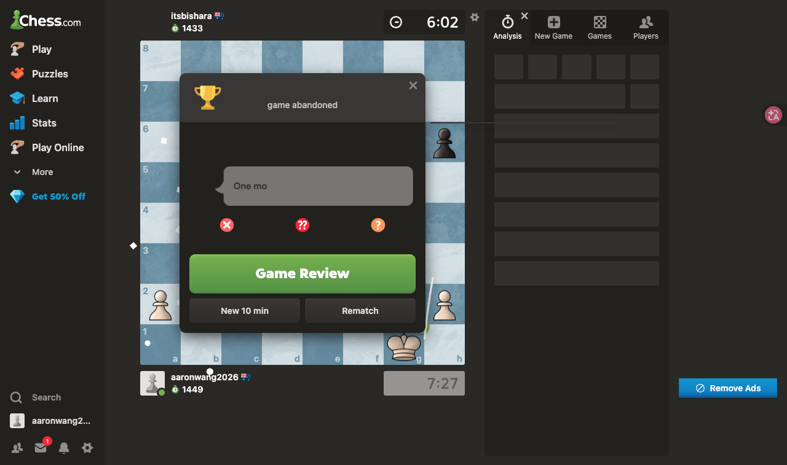
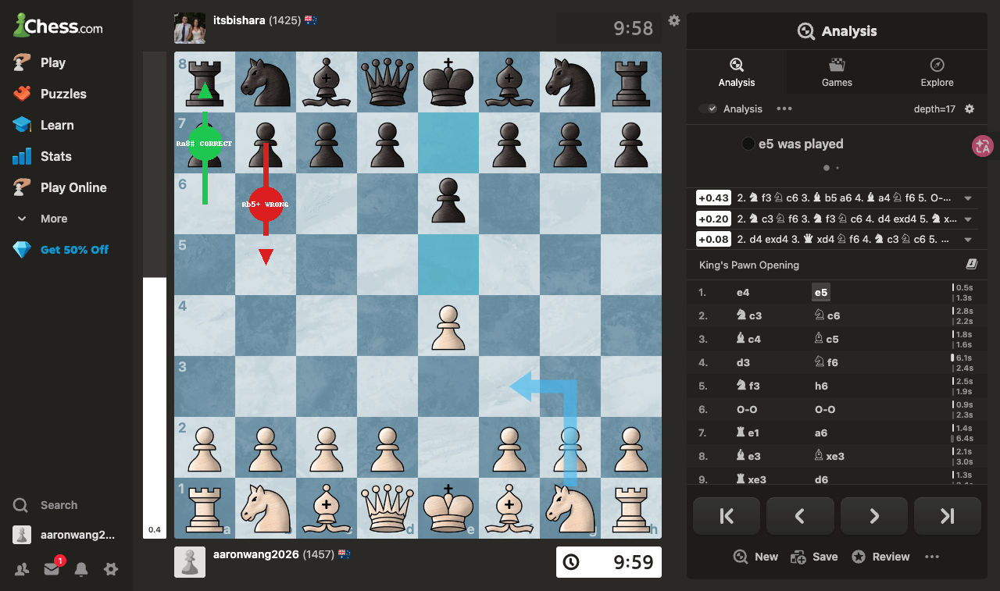
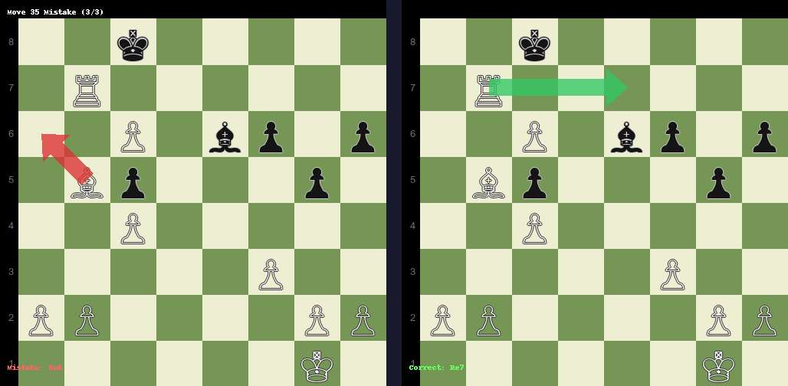

# aaronwang2026 (⚪) vs itsbishara (⚫) | 2026-05-25 | 1-0

## 总体评价
白方 (aaronwang2026) 在意大利开局中后段连续失误，但凭借子力优势和对手最后逃跑最终获胜。

## 📊 棋局概览
- **下棋时间**：2026-05-25
- **执白**：aaronwang2026（1457）
- **执黑**：itsbishara（1425）
- 比赛结果：**1-0**（对手弃子获胜）
- 总回合数：41 步
- 时间控制：600s（闪电战）
- 开局：Giuoco Piano / Italian Four Knights Variation

## 🎯 亮点时刻
- **第13步** — Qxd4 吃掉黑马，获得 +2.65 局面优势
- **第36步** — Rb5+ 将军抽车（虽然错过了直接绝杀 Ra8#）

## ⚠️ 关键失误（按重要性排序）

1. **第36步** — 💥 **错过绝杀**
   - 跌 **1007.90 兵**
   - 实际走法：`Rb5+`（车 b7 → b5，将军）
   - 正确走法：`Ra8#`（车 a6 → a8，将死）
   - 原因：白方车在 a6，应直接走 Ra8# 将死黑王，而不是车绕到 b5 将军错过绝杀机会
   - 局面：白棋 c7 兵已升变为皇后在 c8，黑王在 c8，白方先走
   

2. **第35步** — 💥
   - 跌 **19.80 兵**（-0.1 → -10.6）
   - 推荐着法：`Re7`
   - 原因：象走到 a6 偏离主战场，应车移到 e7 加强进攻
   

## 💡 可以更好的地方
- 意大利开局应谨慎出子，避免第 2-6 步的连环失误
- 优势局面下不要急于进攻，应稳扎稳打积累子力
- 注意王的安全，避免被对手反击
- **最重要**：当对手王被围困且己方车畅通时，走棋前先目测直线将杀路径

## 📚 开局学习建议
- 意大利开局建议先出象到 c4 而非 c1，保持子力协调
- 后续可深入学习意大利开局的经典变化与陷阱

## 🌟 今日收获
- 优势时保持冷静，不要急于进攻导致优势瓦解
- 即使连续失误，只要不致命仍有机会获胜
- **绝杀优先原则**：已有子力优势时，先确认能否将杀再走其他着法

## 附录：局面评估走势 + 失误详情（合一表）

白方（aaronwang2026）共 **3 次失误**

> 💥 = BLUNDER  ⚠️ = MISTAKE  🔴 = 白方  🟡/🟢 = 黑方

| 步 | 着法 | 评估 | 趋势 |
|---|---|---|---|
| 1 | e4 | ⚖️ -0.45 | |
| 2 | Nc3 | ⚖️ -0.14 | ⚠️ MISTAKE |
| 4 | d3 | ⚖️ -0.19 | ⚠️ MISTAKE |
| 5 | Nf3 | ⚖️ -0.18 | ⚠️ MISTAKE |
| 6 | O-O | ⚖️ -0.19 | ⚠️ MISTAKE |
| 13 | Qxd4 | 🟢 +2.65 | 💥 BLUNDER (opponent) |
| 14 | Nh4 | 🔴 -0.47 | 💥 BLUNDER |
| 15 | Rg3 | 🔴 -1.49 | 💥 BLUNDER |
| 16 | Re1 | 🔴 -2.09 | 💥 BLUNDER |
| 17 | Rxe8+ | 🔴 -1.87 | 💥 BLUNDER |
| 18 | Nxf5 | 🔴 -2.06 | 💥 BLUNDER |
| 19 | Bf1 | 🔴 -5.44 | 💥 BLUNDER |
| 20 | Re3 | ⚖️ +0.06 | 💥 BLUNDER |
| 21 | Ra3 | ⚖️ -0.13 | 💥 BLUNDER |
| 22 | dxc6 | 🔴 -3.93 | 💥 BLUNDER |
| 23 | Qxc5 | 🔴 -4.11 | 💥 BLUNDER |
| 24 | Bxa6 | 🔴 -3.64 | 💥 BLUNDER |
| 25 | Bc4+ | 🔴 -7.20 | 💥 BLUNDER |
| 26 | Rxa8 | 🔴 -7.90 | 💥 BLUNDER |
| 27 | Bb5 | 🔴 -8.04 | 💥 BLUNDER |
| 28 | Rc8 | 🔴 -8.03 | 💥 BLUNDER |
| 29 | f3 | 🔴 -8.21 | 💥 BLUNDER |
| 30 | c4 | 🔴 -8.53 | 💥 BLUNDER |
| 31 | Rb8 | 🔴 -7.81 | 💥 BLUNDER |
| 32 | Rb7+ | 🔴 -7.98 | 💥 BLUNDER |
| 33 | Rxb6 | 🔴 -8.15 | 💥 BLUNDER |
| 34 | Rb7+ | 🔴 -8.24 | 💥 BLUNDER |
| 35 | Ba6 | 🔴 -10.65 | 💥 BLUNDER |
| 36 | c7+ | 🔴 -9.08 | 💥 BLUNDER |
| 37 | Rb5+ | 🔴 **+297** → **-711** | 💥 **错过 Ra8# 绝杀** |
| 38 | Rxc5+ | 🔴 -7.92 | 💥 BLUNDER |
| 39 | b4 | 🔴 -8.38 | 💥 BLUNDER |
| 40 | Rc6+ | 🔴 -9.20 | 💥 BLUNDER |
| 41 | Rxe6 | 🔴 -9.14 | 💥 BLUNDER |

### 关键局面 FEN

| 步 | FEN |
|---|---|
| 第35步 | `2k5/1R6/2P1bp1p/1Bp3p1/2P5/5P2/PP4PP/6K1 w - - 3 35` |
| 第36步 | `3k4/1R6/B1P1bp1p/2p3p1/2P5/5P2/PP4PP/6K1 w - - 5 36` |
| 第37步 | `2k5/1RP5/B3bp1p/2p3p1/2P5/5P2/PP4PP/6K1 w - - 1 37` |